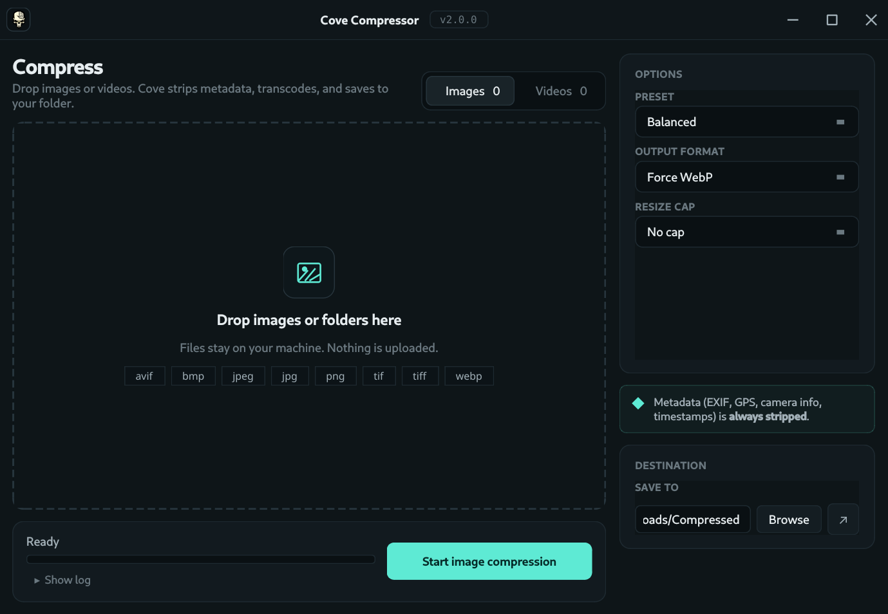

# Cove Compressor

Dark, offline, batch image and video compression. Drop files in, pick a preset,
hit Start. No cloud, no API keys, no accounts. `ffmpeg` is bundled inside every
release artifact.

One codebase, native builds for both platforms: a Windows installer + portable
exe, and a Linux AppImage + .deb. Every `v*` tag cuts all four artifacts via
GitHub Actions.




---

## What's new in 2.0

Cove Compressor 2.0 is a full redesign on top of the same compression core that
drove every prior build. Every knob from 1.x is still there — nothing was
simplified away.

### Redesigned UI

- **Frameless window** with a custom title bar matching the rest of the Cove
  suite (skull badge, title, version pill, min/max/close). Double-click the
  titlebar to maximize, drag anywhere on it to move, drag any edge to resize.
- **Dark teal theme** — `Inter` body + `JetBrains Mono` for numeric labels.
  Mint accent (`#5eead4`) on the Start button, progress bar, and selection
  highlight.
- **Two-column layout** — main column is the drop zone / file list / action
  bar; side column is the Options card, privacy note, and Destination card.

### Drop zone + file queue

- **Big visual drop zone** in the empty state, with supported-format chips
  (`avif  bmp  jpeg  jpg  png  tif  tiff  webp` on the Images tab; `avi  flv
  m4v  mkv  mov  mp4  webm  wmv` on Videos). Turns mint-bordered while dragging.
- **Table-style queue** once populated — `FILE / SIZE / STATUS / ✕` columns,
  toolbar on top with *N items · total size* plus **Add more…**, **Add folder…**,
  and **Clear**.
- **Drop files or whole folders** — folders are scanned recursively for
  supported extensions.
- **Real image / video thumbnails** in each row — 96×56 previews. Images are
  thumbnailed via Pillow (respects EXIF rotation); videos are a single-frame
  grab via the bundled `ffmpeg`. Cached per-path, generated on background
  threads with a concurrency cap so a 50-file drop doesn't fork 50 ffmpegs.
- **Multi-file / multi-folder queue** — drop several things in, remove
  individual ones with **✕** or **Delete**, or wipe the whole list with **Clear**.
- **Visible selection** — clicking a row highlights it with a mint border +
  mint tint so it's obvious which row will respond to **Delete**.

### Options (per tab)

**Images:**
- **Preset** — Light / Balanced / Aggressive
- **Output format** — Keep original / Force JPEG / Force PNG / Force WebP /
  Force AVIF
- **Resize cap** — No cap / 4000 / 2560 / 1920 / 1280 px (longest edge)

**Videos:**
- **Method** — *Quality preset* (CRF), *Target file size* (MB, 2-pass), or
  *Target reduction* (% smaller, 2-pass)
- **Output format** — MP4 (H.265), MP4 (H.264), MKV (H.265), WebM (VP9)
- **Resolution cap** — Original / 1080p / 720p / 480p
- **Audio kbps** — 128 / 192 / 320
- Quality presets: Web Small / Balanced / Archive Light (CRF values tuned per
  codec — x265, x264, VP9)

### Action bar

- **Status line** — current file + stage (`pass 1/2`, `pass 2/2`, `encoding`)
- **Mint-glow progress bar** with live ETA
- **Start / Cancel** swap in place — mid-batch cancellation terminates the
  running ffmpeg cleanly
- **Show log** disclosure — the log panel is hidden by default and expands
  below on demand with **Copy** / **Clear** buttons

### Completion banner

After a batch finishes, a mint-bordered card appears at the top of the main
column: `✓ Saved 1.2 GB (47%) · 12 images compressed`, with a one-click **Open
output folder** button and a **✕** to dismiss. The banner auto-hides when you
start the next batch.

### Destination

A single "Save to" field shared across tabs, a Browse button, and an **↗**
shortcut that opens the folder in your OS file manager (inside the AppImage
this strips `LD_LIBRARY_PATH` before spawning `xdg-open` so the bundle's libs
don't poison the child process).

### Other polish

- **Persistent settings** — last-used preset, format, resize cap, video method
  values, audio bitrate, resolution cap, output folder, log visibility, last
  tab, and window geometry all survive restarts via `QSettings`
  (`~/.config/Cove/Cove Compressor.conf` on Linux,
   `HKCU\Software\Cove\Cove Compressor` on Windows).
- **Auto-updater** — on launch a background thread checks GitHub Releases; when
  a newer `v*` tag exists, a non-blocking prompt appears. On AppImage installs
  the download-and-swap happens end-to-end (kernel keeps the running mmap alive
  across overwrite, then re-execs). On Windows Setup / Portable / .deb the
  release page opens and the user runs the installer themselves.
- **Metadata always stripped** — EXIF, GPS, camera info, and timestamps are
  dropped from every compressed image.

---

## Install a prebuilt release

Head to the [Releases page](https://github.com/Sin213/cove-compressor/releases)
and grab the artifact for your OS:

| OS      | Artifact                                      | Notes                                         |
| ------- | --------------------------------------------- | --------------------------------------------- |
| Windows | `cove-compressor-<version>-Setup.exe`         | Inno Setup installer (Start Menu + Desktop)   |
| Windows | `cove-compressor-<version>-Portable.exe`      | Single-file, no install                       |
| Linux   | `Cove-Compressor-<version>-x86_64.AppImage`   | `chmod +x` and run                            |
| Linux   | `cove-compressor_<version>_amd64.deb`         | `sudo apt install ./cove-compressor_*.deb`    |

`ffmpeg` and `ffprobe` are **bundled inside every artifact** — no separate
install needed on either platform.

> **Windows SmartScreen** may warn on first launch because the exe isn't
> signed. Click **More info → Run anyway**.

---

## Running from source (Linux)

Python 3.10+.

```bash
python -m venv .venv
.venv/bin/pip install -r requirements.txt
.venv/bin/python -m cove_compressor
```

Make sure `ffmpeg` and `ffprobe` are on PATH (e.g. `sudo pacman -S ffmpeg` on
Arch, `sudo apt install ffmpeg` on Debian/Ubuntu), or drop `ffmpeg`/`ffprobe`
binaries next to the project root.

### PYTHONPATH shortcut

The package lives under `src/`; the entry point is `cove_compressor.__main__`.
If you prefer running from a checkout without installing:

```bash
PYTHONPATH=src python -m cove_compressor
```

---

## Running from source (Windows)

Python 3.10+ from [python.org](https://www.python.org/downloads/) (tick
**"Add python.exe to PATH"** during install).

```powershell
py -m venv .venv
.venv\Scripts\pip install -r requirements.txt
$env:PYTHONPATH = "src"
.venv\Scripts\python -m cove_compressor
```

Install `ffmpeg` either via winget (`winget install Gyan.FFmpeg`) or drop
`ffmpeg.exe` + `ffprobe.exe` into the project root.

---

## Building release artifacts yourself

PyInstaller can't cross-compile, so each platform has its own script. Both
download `ffmpeg` automatically.

### Linux — AppImage + .deb

```bash
bash scripts/build-release.sh
# Output in release/:
#   Cove-Compressor-2.0.0-x86_64.AppImage
#   cove-compressor_2.0.0_amd64.deb
```

Flags:
- `VERSION=2.1.0 bash scripts/build-release.sh` — override the version tag.
- `APPIMAGE_ONLY=1 bash scripts/build-release.sh` — skip the .deb step for
  faster iteration.

### Windows — Setup.exe + Portable.exe

Requires [Inno Setup 6](https://jrsoftware.org/isdl.php) (pre-installed on
GitHub Actions' `windows-latest`).

```powershell
.\build.ps1 -Version 2.0.0
# Output in release\:
#   cove-compressor-2.0.0-Setup.exe
#   cove-compressor-2.0.0-Portable.exe
```

#### Cross-build from Linux (Wine)

If you're on Linux and have a Wine prefix at `$HOME/.wine-covebuild` with
Windows Python 3.12, PySide6, Pillow, `pillow-avif-plugin`, and PyInstaller
installed (the shared Cove build prefix), the Windows artifacts can be built
without a Windows machine:

```bash
VERSION=2.0.0 bash scripts/build-windows-wine.sh
```

The script downloads the gyan.dev `ffmpeg` release-essentials build,
installs Inno Setup 6 under Wine if missing, runs PyInstaller through Wine
twice (onedir + onefile), and drops `cove-compressor-<version>-Setup.exe` +
`cove-compressor-<version>-Portable.exe` into `release/` alongside the
Linux artifacts.

### Automated release via GitHub Actions

Push a tag matching `v*` (e.g. `v2.0.0`) and `.github/workflows/release.yml`
runs the Linux + Windows jobs in parallel and attaches all four artifacts to
the GitHub Release created for the tag.

---

## Project layout

```
src/cove_compressor/
  __init__.py          # __version__
  __main__.py          # entry point
  app.py               # MainWindow + redesigned UI
  compressor.py        # compress_image / compress_video + helpers
  thumbnails.py        # threaded thumbnail cache
  theme.py             # palette + QSS
  titlebar.py          # frameless titlebar
  updater.py           # GitHub Releases auto-updater
  assets/cove_icon.png
packaging/
  installer.iss        # Inno Setup script (Windows installer)
  launcher.py          # PyInstaller top-level entry
  cove-compressor.desktop
scripts/
  build-release.sh     # Linux AppImage + .deb builder
build.ps1              # Windows Setup.exe + Portable.exe builder
```

---

## Defaults

| Tab    | Setting           | Default              |
|--------|-------------------|----------------------|
| Images | Preset            | Balanced             |
| Images | Output format     | Keep original        |
| Images | Resize cap        | No cap               |
| Videos | Method            | Quality preset       |
| Videos | Preset            | Balanced             |
| Videos | Output format     | MP4 (H.265)          |
| Videos | Resolution cap    | Original             |
| Videos | Audio bitrate     | 192 kbps             |
| —      | Output folder     | `~/Downloads/cove-compressed` |

---

## Keyboard

| Action                              | Key                                   |
| ----------------------------------- | ------------------------------------- |
| Remove selected queue row           | `Delete` / `Backspace`                |
| Drag the window                     | Left-drag on the titlebar             |
| Maximize / restore                  | Double-click the titlebar             |
| Resize the window                   | Left-drag on any edge                 |

---

## Licensing

- Cove Compressor is **MIT** — see `LICENSE`.
- The bundled `ffmpeg` / `ffprobe` binaries are the **gyan.dev
  release-essentials** (Windows) and **johnvansickle.com static** (Linux)
  builds, both **GPLv3**. Cove Compressor shells out to those binaries rather
  than linking, so the app's MIT licensing stands. If you redistribute release
  artifacts, comply with the ffmpeg GPL terms — most commonly by keeping
  `FFMPEG-LICENSE.txt` alongside the binary and pointing recipients at
  [ffmpeg.org](https://ffmpeg.org/) for sources.
