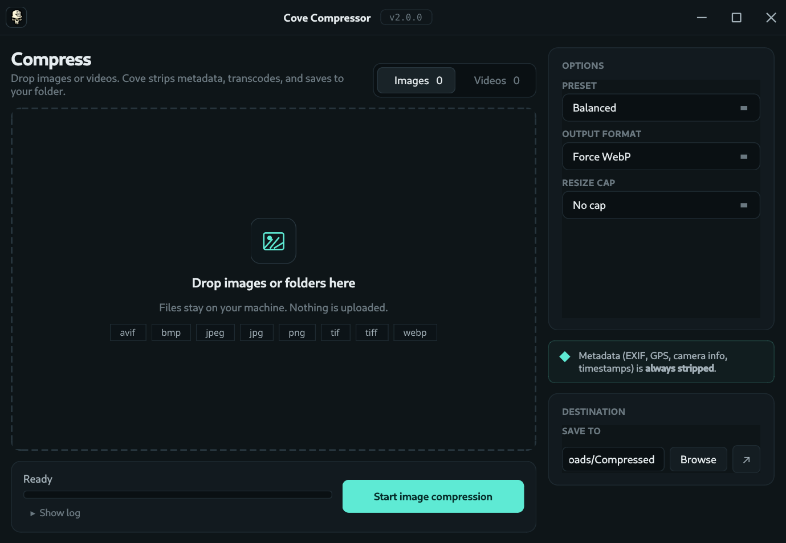

# Cove Compressor

Dark, offline, batch image and video compression. Drop files in, pick a preset,
hit Start. No cloud, no API keys, no accounts. `ffmpeg` is bundled inside every
release artifact.

One codebase, native builds for both platforms: a Windows installer + portable
exe, and a Linux AppImage + .deb. Every `v*` tag cuts all four artifacts via
GitHub Actions.




---

## Features

### Batch queue

- Drop files or whole folders (scanned recursively), or use **Add files…** /
  **Add folder…**. Remove rows with **✕** / **Delete**, wipe with **Clear**.
- Real thumbnails in every row — Pillow for images (EXIF-rotation aware),
  single-frame grabs via the bundled `ffmpeg` for videos, generated on
  background threads with a concurrency cap.
- Formats: images `avif bmp jpeg jpg png tif tiff webp`; videos
  `avi flv m4v mkv mov mp4 webm wmv`.

### Images

- Preset — Light / Balanced / Aggressive
- Output format — Keep original / Force JPEG / Force PNG / Force WebP / Force AVIF
- Resize cap — No cap / 4000 / 2560 / 1920 / 1280 px (longest edge)

### Videos

- Method — *Quality preset* (CRF), *Target file size* (MB, 2-pass), or
  *Target reduction* (% smaller, 2-pass)
- Output format — MP4 (H.265 / H.264), MKV (H.265), WebM (VP9)
- Resolution cap — Original / 1080p / 720p / 480p · Audio — 128 / 192 / 320 kbps

### Hardware acceleration

On GPUs that support it, H.264 / H.265 encodes offload to **NVIDIA NVENC** or
**AMD AMF**, several times faster than the CPU. *Automatic* (default) probes
each vendor with a real one-frame test encode at launch and falls back
NVENC → AMF → CPU; unsupported choices grey out. WebM (VP9) has no GPU
equivalent and always encodes on the CPU.

### Destination

- One **Save to** folder shared across tabs, with Browse and an **↗** shortcut
  that opens it in your file manager.
- **Save into each file's own folder** (default off) — writes every result next
  to its original instead; recursive folder drops return to their own
  subdirectories. The Save-to controls grey out while it's on, and name
  collisions get numbered suffixes (`photo_1.webp`).

### Opt-in conversion options (default off)

- **Delete source after successful conversion** — permanently removes each
  original after a real success only: skipped, errored, cancelled, timed-out,
  and subtitle-failed files always keep their source.
- **Extract English subtitles before conversion** (Videos) — rescues embedded
  English subtitle streams into sidecar files before the encode re-encodes
  them away. Text subtitles become `.srt`, styled ones keep `.ass`, anything
  else lands in a subtitle-only `.mks`, named
  `<output>.eng[.forced][.sdh].<ext>` beside the converted video and never
  overwriting an existing sidecar.

The run summary reports both options when active, e.g.
`Deleted originals: 1   Delete failures: 0`.

### Run feedback

- Status line with per-file stage (`pass 1/2`, `encoding`, `encoding · GPU`),
  mint progress bar with live ETA, Start/Cancel swap mid-batch.
- Hidden-by-default log panel with **Copy** / **Clear**.
- Completion banner — `✓ Saved 1.2 GB (47%) · 12 images compressed` — with a
  one-click **Open output folder** button.

### Everything else

- **Frameless dark-teal UI** (Inter + JetBrains Mono, mint accent) with a
  custom title bar: drag to move, double-click to maximize, drag edges to
  resize.
- **Persistent settings** — every option, the destination choices, log
  visibility, last tab, and window geometry survive restarts via `QSettings`
  (`~/.config/Cove/Cove Compressor.conf` on Linux,
  `HKCU\Software\Cove\Cove Compressor` on Windows).
- **Auto-updater** — checks GitHub Releases on launch; AppImages download and
  swap end-to-end, other installs open the release page.
- **Metadata always stripped** — EXIF, GPS, camera info, and timestamps are
  dropped from every compressed image.

---

## Install a prebuilt release

Head to the [Releases page](https://github.com/Sin213/cove-compressor/releases)
and grab the artifact for your OS:

| OS      | Artifact                                      | Notes                                         |
| ------- | --------------------------------------------- | --------------------------------------------- |
| Windows | `cove-compressor-<version>-Setup.exe`         | Inno Setup installer (Start Menu + Desktop)   |
| Windows | `cove-compressor-<version>-Portable.exe`      | Single-file, no install                       |
| Linux   | `Cove-Compressor-<version>-x86_64.AppImage`   | `chmod +x` and run                            |
| Linux   | `cove-compressor_<version>_amd64.deb`         | `sudo apt install ./cove-compressor_*.deb`    |

`ffmpeg` and `ffprobe` are **bundled inside every artifact** — no separate
install needed on either platform.

> **Windows SmartScreen** may warn on first launch because the exe isn't
> signed. Click **More info → Run anyway**.

---

## Running from source (Linux)

Python 3.10+.

```bash
python -m venv .venv
.venv/bin/pip install -r requirements.txt
.venv/bin/python -m cove_compressor
```

Make sure `ffmpeg` and `ffprobe` are on PATH (e.g. `sudo pacman -S ffmpeg` on
Arch, `sudo apt install ffmpeg` on Debian/Ubuntu), or drop `ffmpeg`/`ffprobe`
binaries next to the project root.

### PYTHONPATH shortcut

The package lives under `src/`; the entry point is `cove_compressor.__main__`.
If you prefer running from a checkout without installing:

```bash
PYTHONPATH=src python -m cove_compressor
```

---

## Running from source (Windows)

Python 3.10+ from [python.org](https://www.python.org/downloads/) (tick
**"Add python.exe to PATH"** during install).

```powershell
py -m venv .venv
.venv\Scripts\pip install -r requirements.txt
$env:PYTHONPATH = "src"
.venv\Scripts\python -m cove_compressor
```

Install `ffmpeg` either via winget (`winget install Gyan.FFmpeg`) or drop
`ffmpeg.exe` + `ffprobe.exe` into the project root.

---

## Building release artifacts yourself

PyInstaller can't cross-compile, so each platform has its own script. Both
download `ffmpeg` automatically.

### Linux — AppImage + .deb

```bash
bash scripts/build-release.sh
# Output in release/:
#   Cove-Compressor-<version>-x86_64.AppImage
#   cove-compressor_<version>_amd64.deb
```

Flags:
- `VERSION=2.1.0 bash scripts/build-release.sh` — override the version tag.
- `APPIMAGE_ONLY=1 bash scripts/build-release.sh` — skip the .deb step for
  faster iteration.

### Windows — Setup.exe + Portable.exe

Requires [Inno Setup 6](https://jrsoftware.org/isdl.php) (pre-installed on
GitHub Actions' `windows-latest`).

```powershell
.\build.ps1 -Version <version>
# Output in release\:
#   cove-compressor-<version>-Setup.exe
#   cove-compressor-<version>-Portable.exe
```

#### Cross-build from Linux (Wine)

If you're on Linux and have a Wine prefix at `$HOME/.wine-covebuild` with
Windows Python 3.12, PySide6, Pillow, `pillow-avif-plugin`, and PyInstaller
installed (the shared Cove build prefix), the Windows artifacts can be built
without a Windows machine:

```bash
VERSION=<version> bash scripts/build-windows-wine.sh
```

The script downloads the gyan.dev `ffmpeg` release-essentials build,
installs Inno Setup 6 under Wine if missing, runs PyInstaller through Wine
twice (onedir + onefile), and drops `cove-compressor-<version>-Setup.exe` +
`cove-compressor-<version>-Portable.exe` into `release/` alongside the
Linux artifacts.

### Automated release via GitHub Actions

Push a tag matching `v*` (e.g. `v2.4.0`) and `.github/workflows/release.yml`
runs the Linux + Windows jobs in parallel and attaches all four artifacts to
a draft GitHub Release created for the tag.

---

## Project layout

```
src/cove_compressor/
  __init__.py          # __version__
  __main__.py          # entry point
  app.py               # MainWindow + redesigned UI
  compressor.py        # compress_image / compress_video + helpers
  thumbnails.py        # threaded thumbnail cache
  theme.py             # palette + QSS
  titlebar.py          # frameless titlebar
  updater.py           # GitHub Releases auto-updater
  assets/cove_icon.png
packaging/
  installer.iss        # Inno Setup script (Windows installer)
  launcher.py          # PyInstaller top-level entry
  cove-compressor.desktop
scripts/
  build-release.sh     # Linux AppImage + .deb builder
build.ps1              # Windows Setup.exe + Portable.exe builder
```

---

## Defaults

| Tab    | Setting           | Default              |
|--------|-------------------|----------------------|
| Images | Preset            | Balanced             |
| Images | Output format     | Keep original        |
| Images | Resize cap        | No cap               |
| Videos | Method            | Quality preset       |
| Videos | Preset            | Balanced             |
| Videos | Output format     | MP4 (H.265)          |
| Videos | Encoder           | Automatic (GPU if available) |
| Videos | Resolution cap    | Original             |
| Videos | Audio bitrate     | 192 kbps             |
| Videos | Extract English subtitles | Off           |
| Both   | Delete source after successful conversion | Off |
| Both   | Save into each file's own folder   | Off                  |
| —      | Output folder     | `~/Downloads/cove-compressed` |

---

## Keyboard

| Action                              | Key                                   |
| ----------------------------------- | ------------------------------------- |
| Remove selected queue row           | `Delete` / `Backspace`                |
| Drag the window                     | Left-drag on the titlebar             |
| Maximize / restore                  | Double-click the titlebar             |
| Resize the window                   | Left-drag on any edge                 |

---

## Licensing

- Cove Compressor is **MIT** — see `LICENSE`.
- The bundled `ffmpeg` / `ffprobe` binaries are the **gyan.dev
  release-essentials** (Windows) and **johnvansickle.com static** (Linux)
  builds, both **GPLv3**. Cove Compressor shells out to those binaries rather
  than linking, so the app's MIT licensing stands. If you redistribute release
  artifacts, comply with the ffmpeg GPL terms — most commonly by keeping
  `FFMPEG-LICENSE.txt` alongside the binary and pointing recipients at
  [ffmpeg.org](https://ffmpeg.org/) for sources.
